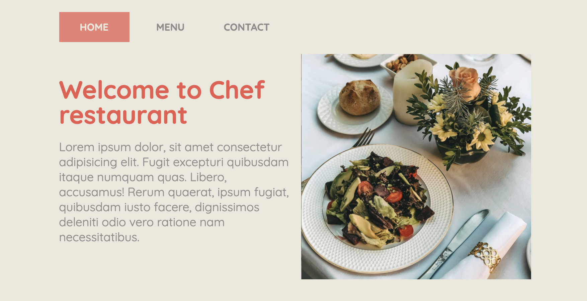

# JS-Restaurant-Page

> Restaurant page using benefits of ES6's modularized code. Project is made of different modules using webpack.

## Built With
- HTML & CSS
- JavaScript/ES6
- Webpack
- eslint
- style lint

## Live Demo

> Click [here](https://chef-restaurant.netlify.app/) for live demo

## Author

👤 **Azamat Nuriddinov**

- Github: [@bettercallazamat](https://github.com/bettercallazamat)
- Twitter: [@azamat_nuriddin](https://twitter.com/azamat_nuriddin)
- Linkedin: [Azamat Nuriddinov](https://www.linkedin.com/in/azamat-nuriddinov-57579868)

## 🤝 Contributing

Contributions, issues and feature requests are welcome!

## Show your support

Give a ⭐️ if you like this project!

## 📝 License

This project is [MIT](lic.url) licensed.
